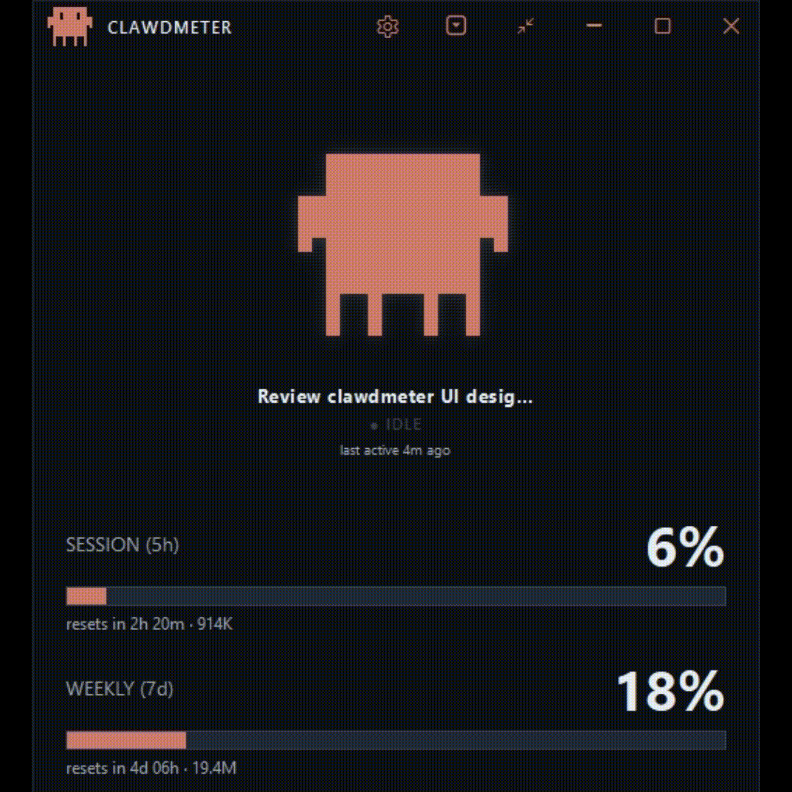

# Clawdmeter-Windows

Standalone Windows desktop dashboard for Claude Code usage.

<p align="center">
  
</p>

## What it shows

- **Session (5h) %** with reset countdown
- **Weekly (7d) %** with reset countdown — and a red **overage** state on either
  bar when it climbs past 100% onto usage credits
- **Token usage** for each window (input+output), inline beside the bars and
  broken down per session
- A **session shelf** — one Clawd mascot per active Claude Code session, each
  labeled with its session title and live activity (plus small child mascots for
  any subagents it spins up), falling back to a usage-rate mood when nothing's
  running
- Three **view modes** — the full dashboard, a slim compact list, and a tiny
  always-on-top mini readout
- A system-tray icon whose fill arc tracks session % — **hover it for a quick
  session & weekly readout**


## The mascot reacts to what Claude Code is doing

Clawd's animation and the label beneath it follow your live Claude Code session
in near-real-time — read from the local transcript:

|  |  |
|:--:|:--:|
|  |  |
| **CODING** — editing, writing, running commands | **READING** — reading, grepping, globbing |
|  |  |
| **SEARCHING** — web fetch / search | **THINKING** — reasoning between tool calls |
|  |  |
| **INTEGRATING** — MCP server tool | **PLANNING** — todos, sub-agents & task management |

The small line under the label is **what Claude Code is acting on right now** —
the file it's editing or reading (`transcript.py`), the pattern it's grepping,
the command it's running, or the host it's fetching — so you can tell *what* it's
working on, not just *that* it's working. When there's no natural target it falls
back to the bare tool name (`Edit`, `Read`, …); for an **INTEGRATING** mood it
names the MCP server and tool it's talking to (e.g. `github/list_issues`), so you
can tell which integration Claude Code reached for. An idle session's line
instead reads **last active …**, timed from the session's own last transcript
event rather than the wall clock.

When Claude Code goes quiet, the mascot falls back to a mood driven by your
usage rate — sleepy when you're idle, dancing when you're burning through
tokens (the same 4-group logic as the original firmware).

## Multiple sessions

Run more than one Claude Code session at once and each gets its own mascot on the
**session shelf** — labeled with its **session title** (the one Claude Code shows
for the conversation, or a custom title you've set, falling back to the project
folder name) and its live activity, animating independently. Long titles are
shortened to fit and **scroll into view when you hover** the label, with the full
title on the tooltip. The session/weekly usage bars stay account-wide (a single
number from the API), shown once beneath the shelf.


When a session spins up subagents (the Agent/Task tool), a row of small **child
mascots** appears under that session — one per live agent, each glowing with its
own activity — so a supervising session still looks busy even while its own
transcript is paused waiting on those agents.


The window **sizes itself to fit** the mascots, growing and shrinking as sessions
come and go so there's no empty space. Prefer a fixed size? **Drag the bottom
edge** to set your own height and it sticks; **double-click the title bar** to
snap back to the automatic fit. (Width is always yours — the shelf scrolls
horizontally when more mascots are open than fit.)

Don't want the shelf? In **Settings → Sessions**, turn **Show multiple sessions**
off for a single mascot, and **Show subagents** off to hide the child mascots.

## Token usage

Alongside the percentages, Clawdmeter shows **how many tokens you've actually
used** — read straight from your local Claude Code transcripts, no extra API
calls. The headline figure is **input + output** (the cache reads that dominate
raw totals are kept out of it, so the number reflects real work):

- **Beside the bars** — the 5h total rides the Session reset line and the 7d
  total rides the Weekly line (e.g. `resets in 2h 20m · 914K`).
- **Per session** — each mascot's tile carries that session's running total;
  hover the mascot for a full breakdown (input, output, and the cache buckets).
- **In the tray tooltip** — a `Tokens 914K (5h) · 19.4M (7d)` line under the
  usage readout.

It's all behind one switch — **Settings → Token usage → Show token usage** (on
by default). Turn it off and every token figure disappears.

## Overage

Go past a limit and keep working on paid **usage credits**, and that window's bar
switches to overage: it **empties its normal fill and restarts in red**, growing
from the left by how far past 100% you are, while the percentage keeps climbing —
so **20% over reads `120%`** — and a red **OVERAGE** tag joins the title. It works
on **both** the Session (5h) and Weekly (7d) bars — whichever window you actually
blew through — and clears itself the moment you drop back under 100%.


## View modes

Clawdmeter comes in three sizes and **remembers which one you left it in** across
launches. Two controls in the title bar switch between them: a **square-caret
toggle** flips between the full dashboard and the compact list, and a **mini
button** drops to the tiny readout (from there, double-click — or right-click →
**Expand** — to pop back to whichever view you came from).

**Compact** is a slim, always-on-top list — the two usage bars on top, then one
row per session: mascot, title, token total, and live activity + target — so you
can keep tabs on several sessions in a fraction of the height.


**Mini** shrinks all the way to a frameless, always-on-top chip — the mini mascot
beside your session and weekly percentages, each with a thin usage bar and its
reset time (and the same red overage restart past 100%). It keeps no taskbar
entry and is draggable (it remembers where you left it).


## Download

Grab the latest `Clawdmeter.exe` from the
[Releases](../../releases) page — it's a single self-contained file (~29 MB,
bundling Python + Qt), no install needed. Just run it.

> **Heads up:** the exe is not code-signed, so Windows SmartScreen may show a
> "Windows protected your PC / unknown publisher" prompt the first time you run
> it. Click **More info → Run anyway**. If you'd rather not trust the binary,
> [run from source](#run-from-source) or [build it yourself](#build-the-standalone-exe).

## How it works

It reads your Claude Code OAuth token from `~/.claude/.credentials.json`,
sends a minimal 1-token request to `api.anthropic.com/v1/messages` on a
configurable interval (60s by default), and reads the rate-limit headers from
the response. The window minimises to the system tray; closing the window
hides it. **Quit** from the tray menu fully exits.

## Requirements

- Windows 10 or 11
- Python 3.10 or newer (the code uses 3.10+ syntax)

## Run from source

```powershell
py -3 -m venv .venv
.\.venv\Scripts\pip install -r requirements.txt
.\.venv\Scripts\python src\main.py
```

Add `--mock` to drive the UI with synthetic data (no API calls):

```powershell
.\.venv\Scripts\python src\main.py --mock
```

## Build the standalone .exe

```powershell
.\build.ps1
```

Output: `dist\Clawdmeter.exe` — single-file, no console window, ~29 MB.

`Clawdmeter.spec` prunes the parts of PySide6/Qt the app doesn't use (the
QML/Quick stack, the ~20 MB software-OpenGL fallback, unused image-format and
platform plugins, and Qt's bundled translations) to keep the exe roughly half
the size of an unpruned PySide6 build. If you start importing additional Qt
modules, check the pruning block in the spec so you don't strip something you
now need.

## Settings

Open the settings panel from the gear icon in the title bar.


- **Credentials** — by default the app reads `~/.claude/.credentials.json`. Use
  **Use alternative credentials** (or set `CLAUDE_CREDENTIALS_PATH`) to point at
  a non-default `.credentials.json`.
- **Token** — Claude's OAuth access token expires roughly every 8 hours,
  which would otherwise blank the dashboard. With **Auto-refresh when expired**
  on (the default), the app mints a fresh token automatically so it stays live.
  The **Refresh token now** button is a manual override and is enabled only when
  the token is actually expired.
- **Window** — toggle **Always on top**, **Auto-hide title bar**, and **Quit on
  close** (closes the app instead of minimizing to the tray).
- **Sessions** — **Show multiple sessions** (the session shelf; off shows a single
  mascot for the most recent session) and **Show subagents** (the child mascots).
  Both on by default.
- **Token usage** — **Show token usage** toggles every token figure (the totals
  beside the bars, the per-session tiles and hover breakdown, and the tray line).
  On by default; read from your local transcripts, never the API.
- **Usage polling** — how often the app checks your usage. Each check is a tiny
  billed API request, so the interval is adjustable from **10 to 600 seconds**
  (60 by default): lower is fresher but makes more requests; higher is gentler
  on your quota when you leave it running. Out-of-range entries snap to the
  nearest allowed value.
- **Notifications** — **Notify on limit reset** pings you the moment a usage
  limit resets so you know you can resume — but only when you were actually near
  the limit (or already throttled), so it stays quiet otherwise.

  

  It shows a tray
  notification and briefly flashes the tray icon; **Play a sound**, **Pop the
  window to front**, and **Send a push to my phone** are optional extras you can
  switch off. The phone push reaches you via either **ntfy** or **Telegram**:
  with [ntfy](https://ntfy.sh) (no account or API key) you subscribe to a topic
  of your choosing in the ntfy app — pick a long, hard-to-guess topic since
  anyone who knows it can read your alerts; with **Telegram** you create a bot
  via @BotFather and enter its token and your chat ID. Keep both secret.
- **Start menu** — add or remove a Start-menu shortcut (right-click it in Start
  to pin).

The panel scrolls if the window is too short to fit every section.

## Credit

- **Original project** — concept, firmware, and daemon by Hermann Björgvin
  (@HermannBjorgvin): <https://github.com/HermannBjorgvin/Clawdmeter>. This is a
  software-only Windows port of that work.
- **Clawd pixel art** — the mascot sprites originate from
  <https://claudepix.vercel.app> (as noted in `assets/sprites/manifest.json`),
  extracted from the upstream firmware's `splash_animations.h`.
- **Clawd mascot** — the Clawd character is © Anthropic PBC (see below).

## License & disclaimers

The **source code** in this repository is licensed under the
[MIT License](LICENSE).

The Clawd mascot sprites and related artwork (`assets/sprites/`,
`assets/_splash_animations.h`) are **not** covered by the MIT License. The
Clawd mascot is © Anthropic PBC and remains Anthropic's property. These assets
are included under the same "gray area" as the upstream project and are not
licensed for reuse — if you fork or redistribute, you are responsible for your
own use of them. See [NOTICE](NOTICE) for the full attribution and asset
carve-out.

This is an unofficial, independent project. It is **not affiliated with,
endorsed by, or sponsored by Anthropic**. "Claude", "Clawd", and "Anthropic"
are trademarks of Anthropic PBC, used here for descriptive/identification
purposes only.

This software is provided "as is", without warranty of any kind. Use at your
own risk.
