# Clawdmeter-Windows

Standalone Windows desktop dashboard for Claude Code usage.

<p align="center">
  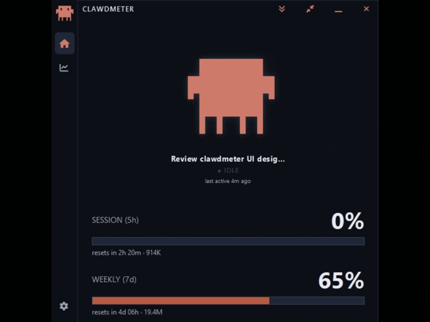
</p>

## What it shows

- **Session (5h) %** with reset countdown
- **Weekly (7d) %** with reset countdown — and a red **overage** state on either
  bar when it climbs past 100% onto usage credits
- **Token usage** for each window (input+output), inline beside the bars and
  broken down per session
- A **session shelf** — one Clawd mascot per active Claude Code session, each
  labeled with its session title and live activity (plus small child mascots for
  any subagents it spins up), falling back to a usage-rate mood when nothing's
  running
- Three **view modes** — the full dashboard, a slim compact list, and a tiny
  always-on-top mini readout
- A **Stats page** — what your subscription is actually worth (value vs price,
  lifetime value, cache savings) and how you use Claude (value by model and
  project, code by language, activity mix, streaks, a daily-value strip and an
  activity heatmap) — all computed locally from your transcripts
- A slim **navigation rail** down the left edge to switch between the
  **Dashboard**, the **Stats** page, and **Settings**
- A system-tray icon whose fill arc tracks session % — **hover it for a quick
  session & weekly readout**

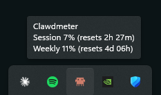

## The mascot reacts to what Claude Code is doing

Clawd's animation and the label beneath it follow your live Claude Code session
in near-real-time — read from the local transcript:

|  |  |
|:--:|:--:|
| 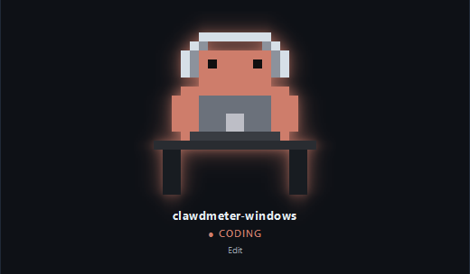 | 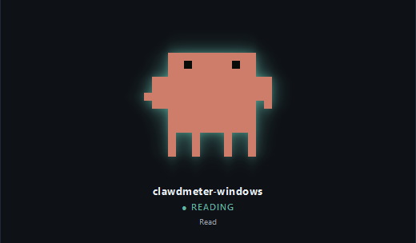 |
| **CODING** — editing, writing, running commands | **READING** — reading, grepping, globbing |
| 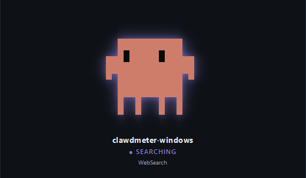 | 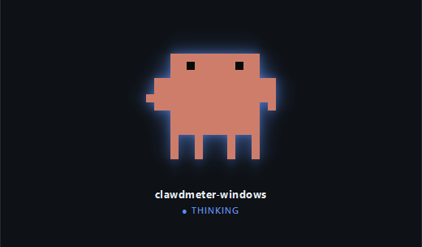 |
| **SEARCHING** — web fetch / search | **THINKING** — reasoning between tool calls |
| 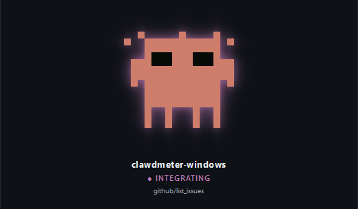 | 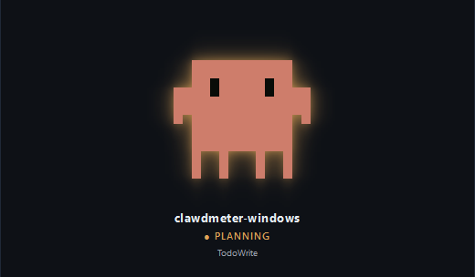 |
| **INTEGRATING** — MCP server tool | **PLANNING** — todos, sub-agents & task management |

The small line under the label is **what Claude Code is acting on right now** —
the file it's editing or reading (`transcript.py`), the pattern it's grepping,
the command it's running, or the host it's fetching — so you can tell *what* it's
working on, not just *that* it's working. When there's no natural target it falls
back to the bare tool name (`Edit`, `Read`, …); for an **INTEGRATING** mood it
names the MCP server and tool it's talking to (e.g. `github/list_issues`), so you
can tell which integration Claude Code reached for. An idle session's line
instead reads **last active …**, timed from the session's own last transcript
event rather than the wall clock.

When Claude Code goes quiet, the mascot falls back to a mood driven by your
usage rate — sleepy when you're idle, dancing when you're burning through
tokens (the same 4-group logic as the original firmware).

## Multiple sessions

Run more than one Claude Code session at once and each gets its own mascot on the
**session shelf** — labeled with its **session title** (the one Claude Code shows
for the conversation, or a custom title you've set, falling back to the project
folder name) and its live activity, animating independently. Long titles are
shortened to fit and **scroll into view when you hover** the label, with the full
title on the tooltip. The session/weekly usage bars stay account-wide (a single
number from the API), shown once beneath the shelf.

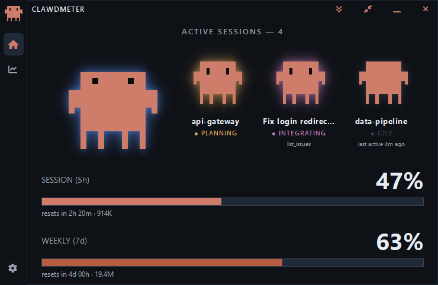

When a session spins up subagents (the Agent/Task tool), a row of small **child
mascots** appears under that session — one per live agent, each glowing with its
own activity — so a supervising session still looks busy even while its own
transcript is paused waiting on those agents.

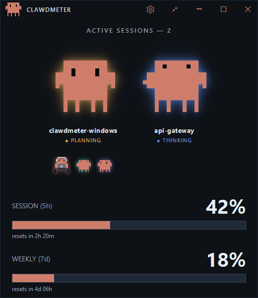

The window **sizes itself to fit** the mascots, growing and shrinking as sessions
come and go so there's no empty space. Prefer a fixed size? **Drag the bottom
edge** to set your own height and it sticks; **double-click the title bar** to
snap back to the automatic fit. (Width is always yours — the shelf scrolls
horizontally when more mascots are open than fit.)

Don't want the shelf? In **Settings → Sessions**, turn **Show multiple sessions**
off for a single mascot, and **Show subagents** off to hide the child mascots.

## Token usage

Alongside the percentages, Clawdmeter shows **how many tokens you've actually
used** — read straight from your local Claude Code transcripts, no extra API
calls. The headline figure is **input + output** (the cache reads that dominate
raw totals are kept out of it, so the number reflects real work):

- **Beside the bars** — the 5h total rides the Session reset line and the 7d
  total rides the Weekly line (e.g. `resets in 2h 20m · 914K`).
- **Per session** — each mascot's tile carries that session's running total;
  hover the mascot for a full breakdown (input, output, and the cache buckets).
- **In the tray tooltip** — a `Tokens 914K (5h) · 19.4M (7d)` line under the
  usage readout.

It's all behind one switch — **Settings → Token usage → Show token usage** (on
by default). Turn it off and every token figure disappears.

## Stats

The **chart icon** in the left nav rail opens a Stats page that turns the usage
you've already racked up into a picture of what your Claude Code subscription is
actually worth. The dollar figures are **computed locally** — your transcripts
priced against a bundled rate card — enriched with Anthropic's OAuth usage
endpoint for real spend and plan details. Every visual is hand-drawn, so the
page adds nothing to the download size.

A plan badge (e.g. `Max 5× · $100/mo`) sits at the top, and below it:

- **API value this month** — what this month's usage would cost at
  pay-as-you-go API rates, measured against your subscription price (e.g. "≈ 33×
  your subscription this month"), with **lifetime value** and the **break-even
  day** (when the month's value first passed what you pay) grouped alongside.
- **Extra usage this month** — real pay-as-you-go spend beyond your plan, from
  the usage endpoint, against your monthly cap if you have one.
- **Cache savings this month** — dollars saved by prompt caching vs paying full
  input price, plus your **cache hit rate**.
- **Time to 7-day cap** — a burn-rate estimate of when you'd hit the weekly limit
  at your current pace (or "steady" / "clear" when you're not on track to).
- **Current streak** and **sessions this month** — your active-day streak (and
  best ever), and how many work sessions you've had (with average and longest).
- **Value by model** and **value by project** — where that value came from,
  broken down by model and by project folder.
- **Code by language** — the languages of the files Claude edited or created this
  month, by share of files (Python, C#, TypeScript, … with an *Other* roll-up).
- **Activity mix** — how your tool calls split across coding, reading, planning,
  thinking, searching and integrating.
- **This week vs last** — this week's value against last week's, with the change.
- **Value per day** — a per-day value bar strip across the month, with date ticks.
- **When you work** — a 7×24 weekday-by-hour heatmap of your activity.
- a **this-month recap** — top model, busiest day, biggest day ever, and totals.

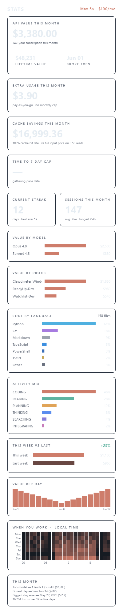

## Overage

Go past a limit and keep working on paid **usage credits**, and that window's bar
switches to overage: it **empties its normal fill and restarts in red**, growing
from the left by how far past 100% you are, while the percentage keeps climbing —
so **20% over reads `120%`** — and a red **OVERAGE** tag joins the title. It works
on **both** the Session (5h) and Weekly (7d) bars — whichever window you actually
blew through — and clears itself the moment you drop back under 100%.

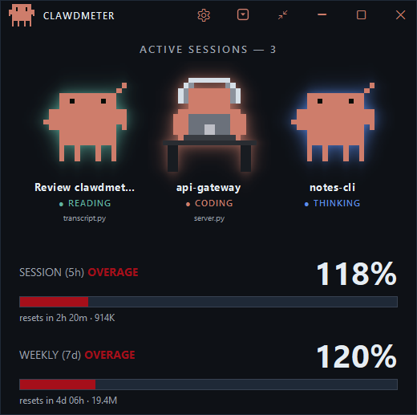

## View modes

Clawdmeter comes in three sizes and **remembers which one you left it in** across
launches. Two controls in the title bar switch between them: a **square-caret
toggle** flips between the full dashboard and the compact list, and a **mini
button** drops to the tiny readout (from there, double-click — or right-click →
**Expand** — to pop back to whichever view you came from).

**Compact** is a slim, always-on-top list — the two usage bars on top, then one
row per session: mascot, title, token total, and live activity + target — so you
can keep tabs on several sessions in a fraction of the height.

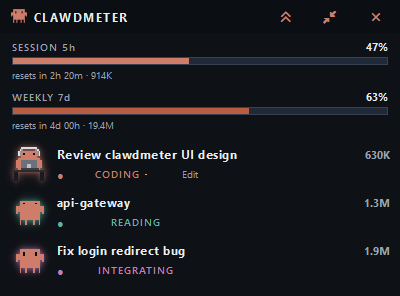

**Mini** shrinks all the way to a frameless, always-on-top chip — the mini mascot
beside your session and weekly percentages, each with a thin usage bar and its
reset time (and the same red overage restart past 100%). It keeps no taskbar
entry and is draggable (it remembers where you left it).

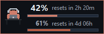

## Settings

Open Settings from the **gear at the bottom of the left nav rail** — it's a
full page in the same window, alongside the Dashboard and Stats, split across
five tabs that each scroll on their own. Here's every setting, grouped by tab.

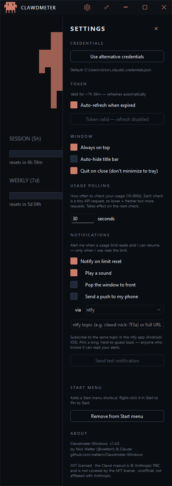

### General

- **Window** — toggle **Always on top**, **Auto-hide title bar** (the title bar
  collapses until you hover the top edge), and **Quit on close** (closes the app
  instead of minimizing to the tray).
- **Startup** — **Start when I sign in to Windows** launches Clawdmeter
  automatically at sign-in. It comes up quietly in the system tray (no window
  pops open) — click the tray icon to open it.
- **Updates** — **Automatically check for updates** (on by default — checks the
  GitHub releases on launch, then about once a day) and **Check for updates now**.
- **Start menu** — add or remove a Start-menu shortcut (right-click it in Start
  to pin).

### Display

- **Sessions** — **Show multiple sessions** (the session shelf; off shows a single
  mascot for the most recent session) and **Show subagents** (the child mascots).
  Both on by default.
- **Token usage** — **Show token usage** toggles every token figure (the totals
  beside the bars, the per-session tiles and hover breakdown, and the tray line).
  On by default; read from your local transcripts, never the API.

### Connection

- **Credentials** — by default the app reads `~/.claude/.credentials.json`. Use
  **Use alternative credentials** (or set `CLAUDE_CREDENTIALS_PATH`) to point at
  a non-default `.credentials.json`.
- **Token** — Claude's OAuth access token expires roughly every 8 hours, which
  would otherwise blank the dashboard. With **Auto-refresh when expired** on (the
  default), the app mints a fresh token automatically so it stays live. The
  **Refresh token now** button is a manual override, enabled only when the token
  is actually expired.
- **Usage polling** — how often the app checks your usage. Each check is a tiny
  billed API request, so the interval is adjustable from **10 to 600 seconds**
  (60 by default): lower is fresher but makes more requests; higher is gentler on
  your quota when you leave it running. Out-of-range entries snap to the nearest
  allowed value.

### Notifications

- **Notify on limit reset** pings you the moment a usage limit resets so you know
  you can resume — but only when you were actually near the limit (or already
  throttled), so it stays quiet otherwise.

  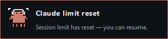

  You choose **where** it reaches you — pick either channel, or both. **Show a
  Windows notification** is the desktop toast plus a brief tray-icon flash, with
  **Play a sound** and **Pop the window to front** as sub-options under it; **Send
  a push notification** delivers off this machine. Under push you can **add one or
  more channels** with **Add a channel** (remove with ✕), and **every channel you
  add fires** on a reset — so you can get, say, a Pushover *and* a Discord alert at
  once. The channels are **[ntfy](https://ntfy.sh)** (subscribe to a hard-to-guess
  topic in the ntfy app — no account needed), **Telegram** (a bot token from
  @BotFather + your chat ID), **Discord** / **Slack** (an incoming-webhook URL),
  **Pushover** (an app API token + your user key), **Gotify** (a self-hosted server
  URL + app token), and a **generic webhook** (a JSON `{title, body, app}` POST to
  any URL — wire it to Zapier / Make / IFTTT / n8n / Home Assistant). Each channel's
  in-app hint says where to get its credential; keep topics/tokens/URLs secret,
  since anyone with them can post to or read your alerts. **Send test notification**
  fires every configured channel at once.

### About

- Version, author, and credits — the source is **MIT** licensed; the Clawd mascot
  is © Anthropic PBC and **not** covered by it; icons are Font Awesome Free.

## Download

Grab the latest `Clawdmeter.exe` from the
[Releases](../../releases) page — it's a single self-contained file (~29 MB,
bundling Python + Qt), no install needed. Just run it.

Clawdmeter checks the Releases page for a newer version on launch (then about
once a day) and, when one's out, shows an **Update available** item in the tray
menu — click it to open the download page and swap in the new `.exe`. You can
turn the automatic check off, or trigger one on demand, under **Settings →
Updates**.

> **Heads up:** the exe is not code-signed, so Windows SmartScreen may show a
> "Windows protected your PC / unknown publisher" prompt the first time you run
> it. Click **More info → Run anyway**. If you'd rather not trust the binary,
> [run from source](#run-from-source) or [build it yourself](#build-the-standalone-exe).

## How it works

It reads your Claude Code OAuth token from `~/.claude/.credentials.json`,
sends a minimal 1-token request to `api.anthropic.com/v1/messages` on a
configurable interval (60s by default), and reads the rate-limit headers from
the response. On the same poll it also reads Anthropic's OAuth usage and profile
endpoints (`/api/oauth/usage`, `/api/oauth/profile`) for your plan, extra-usage
spend and per-model limits. The Stats page values your **local transcripts**
against a bundled price map — no extra API calls. The window minimises to the
system tray; closing the window hides it. **Quit** from the tray menu fully
exits.

## Requirements

- Windows 10 or 11
- Python 3.10 or newer (the code uses 3.10+ syntax)

## Run from source

```powershell
py -3 -m venv .venv
.\.venv\Scripts\pip install -r requirements.txt
.\.venv\Scripts\python src\main.py
```

Add `--mock` to drive the UI with synthetic data (no API calls):

```powershell
.\.venv\Scripts\python src\main.py --mock
```

## Build the standalone .exe

```powershell
.\build.ps1
```

Output: `dist\Clawdmeter.exe` — single-file, no console window, ~29 MB.

`Clawdmeter.spec` prunes the parts of PySide6/Qt the app doesn't use (the
QML/Quick stack, the ~20 MB software-OpenGL fallback, unused image-format and
platform plugins, and Qt's bundled translations) to keep the exe roughly half
the size of an unpruned PySide6 build. If you start importing additional Qt
modules, check the pruning block in the spec so you don't strip something you
now need.

## Credit

- **Original project** — concept, firmware, and daemon by Hermann Björgvin
  (@HermannBjorgvin): <https://github.com/HermannBjorgvin/Clawdmeter>. This is a
  software-only Windows port of that work.
- **Clawd pixel art** — the mascot sprites originate from
  <https://claudepix.vercel.app> (as noted in `assets/sprites/manifest.json`),
  extracted from the upstream firmware's `splash_animations.h`.
- **Clawd mascot** — the Clawd character is © Anthropic PBC (see below).

## License & disclaimers

The **source code** in this repository is licensed under the
[MIT License](LICENSE).

The Clawd mascot sprites and related artwork (`assets/sprites/`,
`assets/_splash_animations.h`) are **not** covered by the MIT License. The
Clawd mascot is © Anthropic PBC and remains Anthropic's property. These assets
are included under the same "gray area" as the upstream project and are not
licensed for reuse — if you fork or redistribute, you are responsible for your
own use of them. See [NOTICE](NOTICE) for the full attribution and asset
carve-out.

This is an unofficial, independent project. It is **not affiliated with,
endorsed by, or sponsored by Anthropic**. "Claude", "Clawd", and "Anthropic"
are trademarks of Anthropic PBC, used here for descriptive/identification
purposes only.

This software is provided "as is", without warranty of any kind. Use at your
own risk.
